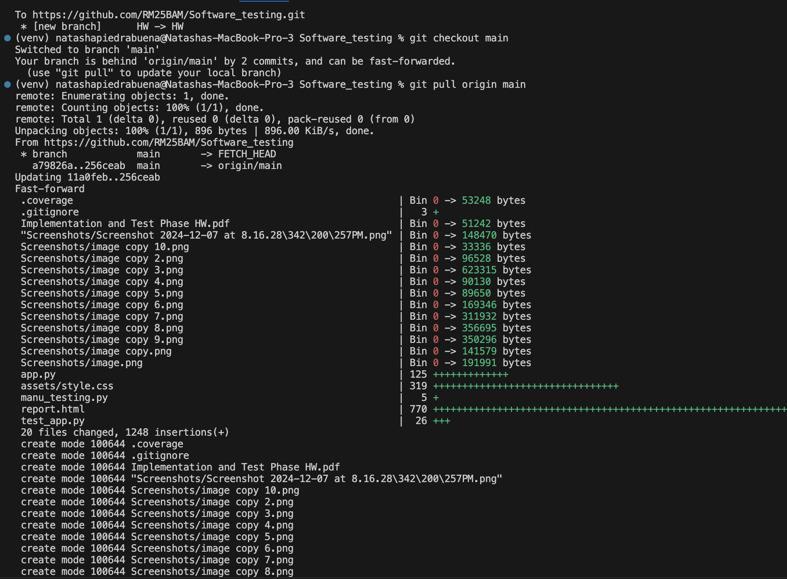

# Software_testing

<p align="center">
  
</p>

In this assignment I implemented two functions from my project (I simplified so it doesnt include firebase or connected to the rest of the functionalities)

---

**Signup & Login**
The signup and login functions are located here -> [Click Here](./app.py).

---

**Automated Testing**
In this project I utilized pytest and I added pytest-html to display in localhost browser and also coverage. 
Located here -> [Click Here](./test_app.py)
- **`pytest`**: Used for writing and executing automated test cases.
- **`pytest-html`**: Generates visually appealing HTML reports for test results.
- **`coverage`**: Measures and reports how much of the codebase is tested.

<p align="center">
  
</p>
<p align="center">
  
</p>
<p align="center">
  
</p>

---

**Github Access**
To start off I created a branch using this command in the temrinal of my project.

``` bash

    git checkout -b Testing
``` 

<p align="center">
  
</p>

``` bash
    git add .
``` 
<p align="center">
  
</p>

``` bash
    git commit -m "message"
```

<p align="center">
  
</p>


<p align="center">
  
</p>

<p align="center">
  
</p>


<p align="center">
  
</p>

<p align="center">
  
</p>

<p align="center">
  
</p>

Git pull 
<p align="center">
  
</p>
**CHECK**
If you want run it?
Setup virtual environment - make sure to have python recent version!

```bash
    python3 -m venv venv
```
Mac 
``` bash
    source venv/bin/activate 
```
Windows
```bash
    venv\Scripts\activate
```
Install all Dependencies 
``` bash
    pip install -r requirements.txt
```
Run program pytest reg
``` bash
    pytest test_app.py -v

```
Run program pytest html
``` bash
    pytest test_app.py -v --html=report.html


```
Run program pytest coverage
```bash
    coverage run -m pytest test_app.py
    coverage report -m
```

p.s. Dr. Abu Mallouh - This is piedrabuena